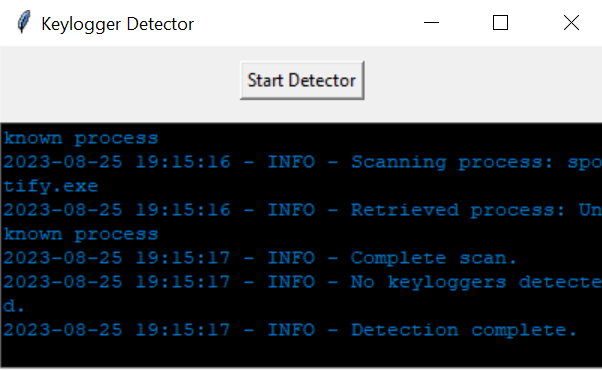

# Keylogger Detector

A Python tool to identify keyloggers and malicious processes on Windows. This GUI-based application uses signature and heuristic methods for detection, enhancing system security.

## Features

- Signature-based detection to identify known keyloggers.
- Heuristic-based detection using process names and window titles.
- User-friendly graphical user interface (GUI).
- Detailed logging of detected processes.

## Requirements

- Python 3.6+
- tkinter
- psutil

## Getting Started

1. Clone the repository:
git clone https://github.com/yourusername/keylogger-detector.git

2. Install required Python packages:
pip install psutil
pip install tkinter

3. Run the Keylogger Detector:
python keylogger_detector.py

## Usage

1. Click the "Start Detector" button to begin the detection process.
2. The tool will scan for known keyloggers using signatures and heuristics.
3. Detected processes will be displayed in the console.

## Screenshots

## License

This project is licensed under the MIT License - see the [LICENSE](LICENSE) file for details.

## Acknowledgements

- Thanks to the [psutil](https://psutil.readthedocs.io/en/latest/) library for process management.

